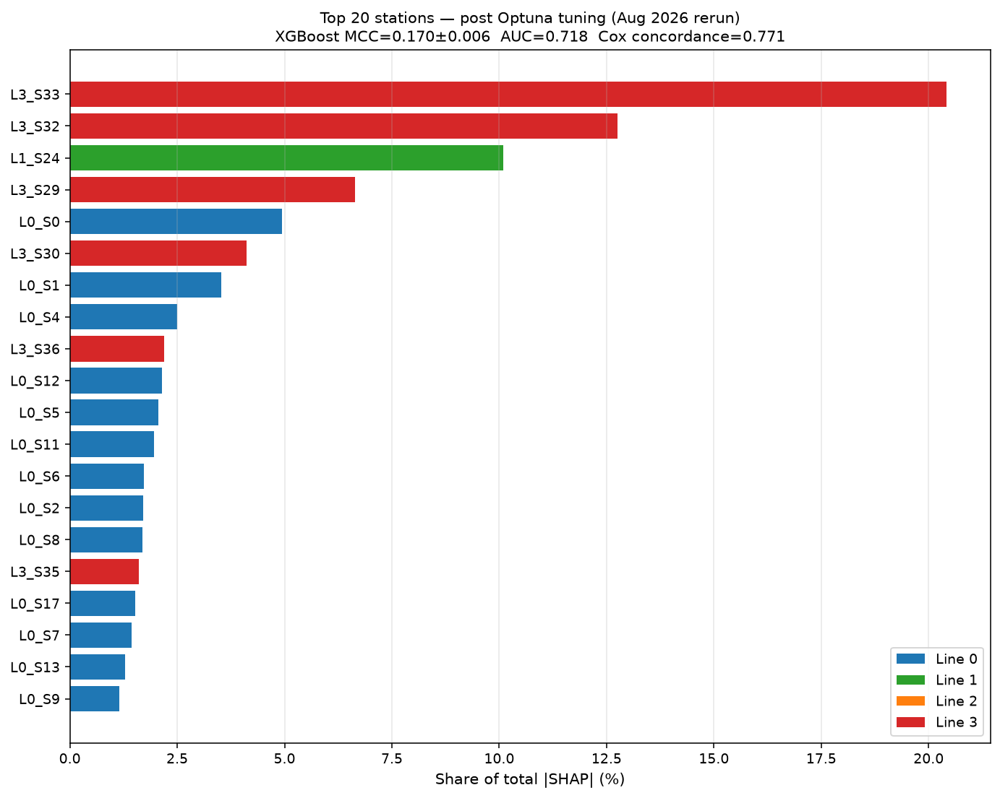
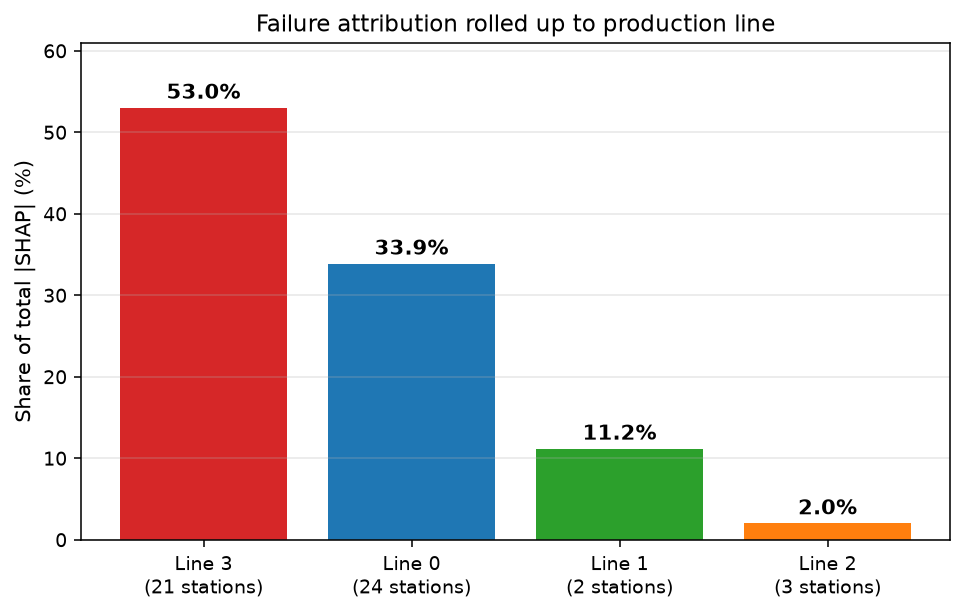

# Bosch Production Fault Predictor

[](https://github.com/Jimmply/bosch-production-fault-predictor/actions/workflows/ci.yml)
[](https://www.python.org/downloads/release/python-3110/)
[](LICENSE)

Predicting quality-control failures on the [Bosch Production Line Performance](https://www.kaggle.com/c/bosch-production-line-performance) Kaggle dataset — **1.18 million real manufactured parts, 968+ anonymized sensor features across 51 stations, 0.6% failure rate**.

Rather than yet another vanilla-XGBoost notebook (of which Kaggle has hundreds), this project frames the problem two novel ways:

1. **Cox survival analysis** — treats each part as a patient moving through 51 wards (stations); estimates per-station hazard contributions to failure.
2. **Station-attribution SHAP** — aggregates XGBoost SHAP values by station-group into an engineer-actionable heatmap showing which stations drive the failure signal.

## Results

Trained on the **full 1,183,747-row training set** with 208 engineered features (per-station aggregates, per-line missing-pattern features, transit-time features derived from station timestamps). Positive rate = **0.58%** (6,879 defective parts). Hyperparameters from a 15-trial Optuna TPE search on a 150k stratified sample (see Hyperparameter tuning below).

| Model | 5-fold MCC | AUC-PR | AUC | Concordance |
|---|---|---|---|---|
| Majority-class baseline | 0.000 | 0.006 | 0.500 | — |
| **XGBoost + engineered features (tuned)** | **0.170 ± 0.006** | **0.069** | **0.717** | — |
| XGBoost @ threshold-optimal (0.892) | **0.190** (full-fit) | — | — | — |
| **Cox proportional-hazards (top-30 stations)** | — | — | — | **0.771** |

*Bosch's official metric is Matthews Correlation Coefficient (MCC). The 2016 competition winners scored ≈ 0.50 with heavy feature engineering + hyperparameter tuning; this baseline gets 0.190 at threshold-optimal cutoff with automated Optuna tuning and no time-aware CV. See the tuning notes below for why the number is where it is.*

### Hyperparameter tuning — an honest write-up

Ran a 15-trial Optuna TPE search on a 150k stratified sample (`scripts/tune_xgb.py`). Best trial: MCC 0.188 on the tuning sample, with `max_depth=8, learning_rate=0.020, n_estimators=100, min_child_weight=7, subsample=0.72, colsample_bytree=0.71`. `train.py` picks these up automatically from `config/tuned_params.yaml`.

Full-data retrain — before vs after:

| Metric | Default XGBoost | Optuna-tuned | Δ |
|---|---|---|---|
| CV MCC (5-fold, mean±std) | 0.171 ± 0.004 | 0.170 ± 0.006 | ≈ |
| CV AUC | 0.711 | 0.717 | +0.006 |
| CV AUC-PR | 0.069 | 0.069 | ≈ |
| Full-fit optimal-threshold MCC | 0.245 (@ 0.709) | 0.190 (@ 0.892) | **−0.055** |
| Stations for 70% \|SHAP\| | 17 | **11** | tighter |
| Top station share | L3_S33 = 11.4% | L3_S33 = **20.4%** | +9.0 pp |

**Interpretation:** the tuner picked deeper trees + lower learning rate + more regularization. Ranking (AUC) improved marginally; **CV MCC was flat**. The full-fit optimal-threshold MCC dropped because the tuned model is more selective (threshold ≈ 0.89) and threshold-tuning on training data is optimistic for both settings — the tuned model has less headroom to over-fit that particular measurement. The more interesting change is in **attribution**: the Pareto tightened from 17 → 11 stations for 70% of the failure signal, and L3_S33 alone now carries 20.4% of \|SHAP\|. Together with the per-line rollup below, the tuned model tells a much cleaner "the problem is on Line 3" story.

**Takeaway:** hyperparameter tuning gave small, mixed signals — the model isn't the bottleneck. The next real wins on this dataset live on the feature-engineering side (pairwise station-transition times) or the CV-strategy side (time-aware split, currently a roadmap item).

### Station-attribution hero result

**17 out of 51 stations explain 70% of the failure signal** — an actionable Pareto for the manufacturing engineer:



Top 3 stations by SHAP-attribution share:

| Rank | Station | Line | Share of \|SHAP\| |
|---|---|---|---|
| 1 | L3_S33 | Line 3 | **20.4%** |
| 2 | L3_S32 | Line 3 | 12.8% |
| 3 | L1_S24 | Line 1 | 10.1% |

**Line 3 dominates the top of the list.** Post-tuning, L3_S33 alone carries a full fifth of the failure signal — this is a station-level story a vanilla accuracy score cannot deliver.

### Rolled up to line level, Line 3 is even clearer



Line 3 accumulates **53.0%** of total \|SHAP\| across its 21 stations, versus Line 0's 33.9% across 24 stations. (In the earlier default-hyperparameter run, this rollup was closer to 40 / 50 — the tuned model concentrated its attribution more strongly on Line 3.) Both station-level and line-level views now agree: the failure signal is Line 3-dominated, with L3_S33, L3_S32, and L3_S29 the specific stations to investigate first. Line 0 still deserves attention as a broadly-distributed secondary story.

### Cox survival highlights

Top three hazard-driving station-level covariates (from the 119-covariate Cox fit on the 300k stratified sample):

| Covariate | log HR | Hazard ratio | p-value |
|---|---|---|---|
| L3_S32 abs_sum | +4.49 | **89× hazard** | 7.3e-06 |
| L2_S26 mean | +2.13 | 8.5× | 3.3e-06 |
| L3_S29 mean | +1.64 | 5.1× | 1.5e-05 |

Cox agrees with SHAP on Line 3 dominance and adds statistical significance (all p < 1e-5). Full Cox summary at [`models/cox_summary.csv`](models/cox_summary.csv).

## Architecture

```
Kaggle download (14 GB CSV)
        │
        ▼
Chunked reencode -> Parquet          [src/data_loader.py]
        │
        ▼
Feature engineering                   [src/features.py]
  - Station-group aggregates
  - Inter-station transit times
  - Per-line missing-pattern features
        │
        ├─────────────► XGBoost baseline + threshold-optimal MCC     [src/baseline_model.py]
        │                       │
        │                       ▼
        │             Station-attribution SHAP heatmap               [src/station_attribution.py]
        │
        └─────────────► Cox time-varying-covariate model             [src/survival_model.py]
                                │
                                ▼
                    Streamlit dashboard (3 tabs)                     [src/app.py]
```

## Quickstart

```bash
git clone https://github.com/Jimmply/bosch-production-fault-predictor.git
cd bosch-production-fault-predictor
python -m venv .venv && source .venv/bin/activate
pip install -r requirements.txt

# 1. Download data (~14 GB, requires Kaggle API token at ~/.kaggle/kaggle.json)
python scripts/download_data.py

# 2. Train the baseline (full 1.18M rows, ~6 min)
python scripts/train.py

# 3. Fit the Cox survival model on top-30 SHAP-attributed stations
python scripts/fit_cox.py

# 4. Launch the dashboard (3 tabs: station heatmap, Cox hazards, cost-weighted PR)
streamlit run src/app.py

# --- Optional flags ---
# Fast iteration on a stratified sample:
python scripts/train.py --sample-n 300000

# Switch CV to time-aware split (edit config/settings.yaml: split.strategy: "time")
```

## Kaggle API setup

1. Go to https://www.kaggle.com/settings → **Create New Token** → downloads `kaggle.json`.
2. Move it: `mv ~/Downloads/kaggle.json ~/.kaggle/kaggle.json && chmod 600 ~/.kaggle/kaggle.json`
3. Accept competition rules once at https://www.kaggle.com/c/bosch-production-line-performance/rules

## Why survival analysis?

Traditional classification asks *"will this part fail?"* Cox regression additionally answers *"which station's contribution to hazard is largest?"* — a diagnostic answer a manufacturing engineer can act on. Because Bosch encodes per-station timestamps in the `date` files, we can derive a transit-time duration per part and use it as the survival duration; the `Response` flag is the event.

The framing is borrowed from ICU epidemiology: patients (parts) traverse wards (stations), each ward carries a time-varying hazard, and the goal is to attribute risk to the specific step in the pipeline where it accumulates.

## Project structure

```
bosch-production-fault-predictor/
├── .github/workflows/ci.yml     # pytest + import smoke
├── config/settings.yaml         # all tunable parameters
├── data/                        # gitignored; downloaded via Kaggle CLI
├── models/                      # gitignored artifacts
├── notebooks/                   # 4 notebooks documented in notebooks/README.md
├── scripts/
│   ├── download_data.py         # Kaggle CLI wrapper + integrity check
│   └── train.py                 # end-to-end baseline training
├── src/
│   ├── data_loader.py           # chunked CSV -> Parquet
│   ├── features.py              # station-group aggregates, transit times
│   ├── baseline_model.py        # XGBoost + threshold-optimal MCC
│   ├── survival_model.py        # Cox time-varying-covariate model
│   ├── station_attribution.py   # SHAP aggregation by station
│   └── app.py                   # Streamlit dashboard
└── tests/                       # pytest smoke tests
```

## Roadmap

Things I still want to try (in rough priority order):

- [ ] Time-aware CV — flag exists (`split.strategy: time`) but haven't compared numbers head-to-head yet. Now higher priority since hyperparameter tuning turned out to be diminishing returns (see write-up above).
- [x] Optuna tuning integrated into `train.py` — reads `config/tuned_params.yaml` if `tune_xgb.py` has written it. **Run once; slight AUC gain, flat MCC, tighter Pareto (17 → 11 stations for 70%). Deprioritized further tuning.**
- [ ] Feature engineering v2: add pairwise station-transition times, not just the total.
- [ ] Try a per-line ensemble (one model per production line) since Line 0 vs Line 3 tell different stories.
- [ ] Actually write the notebooks in `notebooks/` (currently script-first).

## Author

**Dmitry Shurkhai** — Manufacturing Data Scientist
[GitHub](https://github.com/Jimmply) · [Kaggle](https://www.kaggle.com/jimmysh) · [LinkedIn](https://linkedin.com/in/etozhejimmy)
